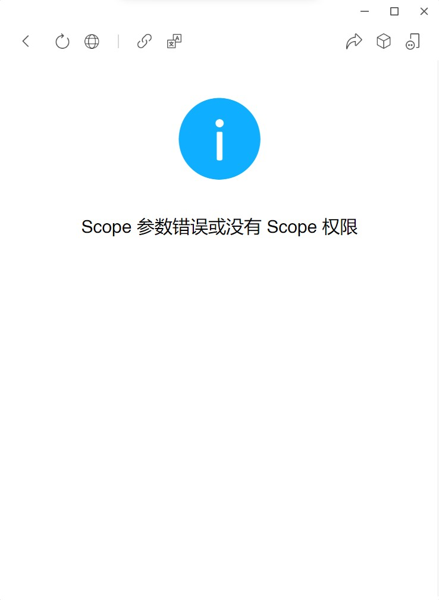
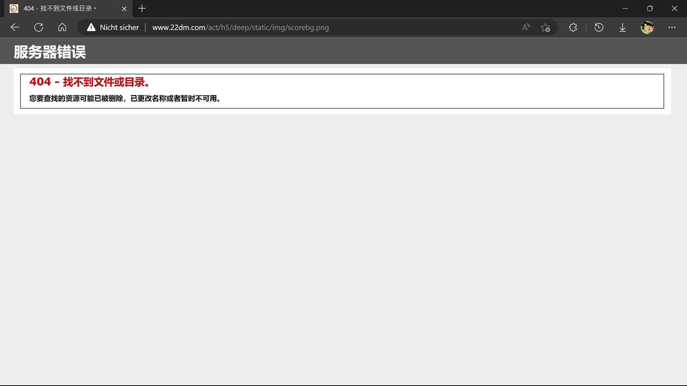
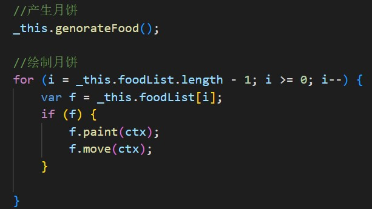
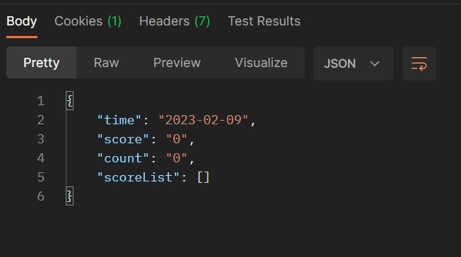
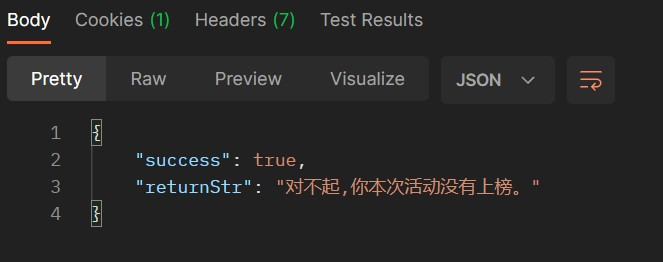
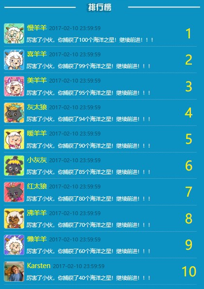

本rep存储着原创动力小游戏和活动页面的原始存档及其修改版本。修改目的在于使游戏或活动页面能够脱离微信和服务器环境使用，这样即使微信授权过期、服务器无法访问，人们依然可以游玩这些游戏或查看活动页面。

# 小透明减压室
原创动力的小游戏“小透明减压室”的原版拷贝及修改版本。
- 活动ID：无
- 项目名称：`jyfy`

## 原始版本
文件夹`www.22dm.com`内存储着游戏的原始版本。游戏本身并不复杂，完全由js驱动，可以在任何地方直接运行。

## 修改版本
文件夹`xyy-huijiwiki.github.io`内存储着游戏的修改版本。修改内容如下：
- 不告知原创动力玩家正在游玩。进入游戏后游戏会自动向`http://www.22dm.com/center/Count/count.ashx`发送POST请求，告知原创动力有人玩游戏，统计数字加一。本来不打算删除的，但是这个链接有跨域保护，不在官方网站玩游戏是会请求失败的。虽然对游戏没有影响，但是控制台会报错，强迫症受不了，删之。
- 删除了Jquery，因为它存在的唯一意义就是发送上面提到的POST请求。
- 游戏结束后会有一个全屏遮罩提示玩家在微信中进行分享。小手一点即可关闭遮罩，但是鼠标点却不行……修改后的版本鼠标点击也可以关闭遮罩了。

## 链接
- [官方游戏链接](http://www.22dm.com/game/jyfy)
- [修改版游戏链接](https://xyy-huijiwiki.github.io/22dm-act/xyy-huijiwiki.github.io/game/jyfy/index.html)
- [羊羊百科](https://xyy.huijiwiki.com/wiki/小透明减压室)

## 秘密
有些不太好的事我就不写进羊羊百科里了。之前收集游戏图片的时候我就注意到，图片内容和对应图片的命名根本毫无关系，所以高度怀疑是直接套用了其他代码制作的游戏。另外游戏文件夹名称`jyfy`究竟是什么意思呢？`jy`可以理解为`减压`，那么`fy`究竟如何理解，会不会也是直接套用其他游戏源码的缘故？

# 性格测试
原创动力的小游戏“性格测试”的原版拷贝及修改版本。
- 活动ID：无
- 项目名称：`cs`

## 原始版本
文件夹`www.22dm.com`内存储着游戏的原始版本。游戏本身并不复杂，完全由js驱动，可以在任何地方直接运行。

## 修改版本
文件夹`xyy-huijiwiki.github.io`内存储着游戏的修改版本。修改内容如下：
- 不告知原创动力玩家正在游玩。进入游戏后游戏会自动向`http://www.22dm.com/center/Count/count.ashx`发送POST请求，告知原创动力有人玩游戏，统计数字加一。本来不打算删除的，但是这个链接有跨域保护，不在官方网站玩游戏是会请求失败的。虽然对游戏没有影响，但是控制台会报错，强迫症受不了，删之。
- 删减了一行css代码，也是对游戏没有影响但控制台会报错。

## 链接
- [官方游戏链接](http://www.22dm.com/tv/cs)
- [修改版游戏链接](https://xyy-huijiwiki.github.io/22dm-act/xyy-huijiwiki.github.io/tv/cs/index.html)
- [羊羊百科](https://xyy.huijiwiki.com/wiki/性格测试)

## 秘密
游戏中的一行css代码会加载一张图片，图片地址为`http://www.22dm.com/tv/cs/images/p.jpg`。这个图片并不存在，也不影响游戏正常运行。这张图片本应作为“返回上一题”按钮的背景图，不过可以看到那个按钮因为位置不变，直接被“印”在了大的背景图里。这一行css代码应该是忘记删了。

# 冲出海洋
原创动力的小游戏“冲出海洋”的原版拷贝及修改版本。
- 活动ID：15
- 项目名称：`deep`

## 原始版本
文件夹`www.22dm.com`内存储着游戏的原始版本。因为游戏有排行系统，需要直接向微信获取信息，所以必须在微信中打开才行。然后微信会报错`Scope 参数错误或没有 Scope 权限`，所以现在玩不了了。

## 修改版本
文件夹`xyy-huijiwiki.github.io`内存储着游戏的修改版本。修改内容如下：
- 去除了所有微信和百度的内容，确保游戏能够独立运行。
- 现在已经无法获取到实际排行榜了，所以我自己杜撰了一个排行榜。另外，玩家得分情况会且只会上传至服务器，刷新页面（重新向服务器获取排行榜）后才会更新排行榜，而修改版的游戏不与服务器连接（连接了也没有，现在排行榜返回空值），所以自己的分数永远不会出现在排行榜中（况且我也获取不到你的微信昵称和头像）。
- 修复了获奖后提交信息时的一处显示bug，不知道是这六年来浏览器版本更新造成的还是微信内置浏览器的特性。
- 领奖时不会真的向服务器发送消息。
- 制作了三个版本，分别对应**活动时间是否结束**和**是否获奖**。

## 链接
请在手机上游玩，或者按F12在开发者工具中调整为竖屏或模拟手机。按F12切换开发者模式会导致游戏出bug，刷新一次即可。
- [官方游戏链接](http://www.22dm.com/act/h5/deep)
- [修改版游戏链接1](https://xyy-huijiwiki.github.io/22dm-act/xyy-huijiwiki.github.io/act/h5/deep/index.html)（活动未结束）
- [修改版游戏链接2](https://xyy-huijiwiki.github.io/22dm-act/xyy-huijiwiki.github.io/act/h5/deep/index2.html)（活动未结束、未获奖）
- [修改版游戏链接3](https://xyy-huijiwiki.github.io/22dm-act/xyy-huijiwiki.github.io/act/h5/deep/index3.html)（活动已结束、获奖）
- [羊羊百科](https://xyy.huijiwiki.com/wiki/冲出海洋)

## 秘密
我对“冲出海洋”这款小游戏印象很深。那时我重新接触喜羊羊不久，陆续发现了羊羊官网、官微、官博等儿时闻所未闻的渠道，非常开心。而“冲出海洋”正是这不久后原创动力推出的一款微信小游戏，是我接触到的第一款羊羊微信小游戏（实际上，如果不算以**嫁人就嫁灰太狼**为主题的[小透明减压室](https://xyy-huijiwiki.github.io/jyfy)和[性格测试](https://xyy-huijiwiki.github.io/cs)的话，这也是第一款羊羊微信小游戏）。不仅如此，“冲出海洋”上线的首月，排名前十的玩家将可以获得羊羊礼品一份。当时我以为这样的活动由来已久，但实际上这是第一次。彼时我应该已经初三下学期了，但是游戏的乐趣和奖励的诱惑依然让我沉迷其中，最终“杀入”前十夺得奖品。

如今六年已经过去——想想六岁的孩子和婴儿的差距吧——曾经怀念童年的时光，如今竟也变得值得怀念了。记得当时我特别厌烦所谓“老粉”的怀旧情绪，就算不反感新剧，也总是抓着过去不放，仿佛羊羊只有过去的辉煌，缺少未来的道路。现在我也有点像这样的“老粉”了，所以才开始了对“冲出海洋”的修改工作。一方面，我挺想再玩一玩这款让我开心、让我获奖、让我印象深刻的小游戏；另一方面，我也想收集一些游戏里的图片，作为[羊羊百科](https://xyy.huijiwiki.com)的配图。

不过当我再次打开游戏时，得到的只有`Scope 参数错误或没有 Scope 权限`。

后来我发现，比“冲出海洋”更早出现的“小透明减压室”和“性格测试”依然可以正常游玩。也就是说，原创动力可能并没有删除游戏，仅仅是因为后来没有维护，没法正常连接微信获取用户数据了而已（因为排名系统使用的是微信头像和微信昵称）。

于是我从当年的微信游戏链接中找到了游戏的实际链接，获取到了HTML文件和JS文件。此时我既兴奋，又害怕，天知道我这点三脚猫的编程水平能让我走到哪一步，不过最坏的结果也是从中找到图片链接，下载下来给**羊羊百科**做配图。

接下来的步骤竟然比较顺利。首先是HTML文件和JS文件中的代码没有被压缩混淆，注释什么的都还在。换言之，我拿到的代码就是给人看的版本。其次，代码中自带debug模式，开启后即可跳过微信验证步骤，我的修改计划直接成功一半。再者，图片文件下载顺利，官网一张图也没删。

这中间还有一个小插曲，上面截图里请求的图片确确实实下载失败了，当时我心就凉了一大截。一张图片下载失败，就意味着有无数张潜在的图片会下载失败。后来我随便拿了一张图顶着，发现图片应该是游戏右上角得分数字的背景。结果，当我翻开当年官方发的微信文章一看，那个地方明明没有背景图啊！虚晃一枪。应该是原本有背景图的，后来取消了，这部分代码又忘记删了——不影响游戏，但是调试游戏的过程中控制台会报错。

另外，在查看“小透明减压室”的代码时，我就怀疑代码是别处复制过来然后改写的，毕竟图片名称和图片内容完全没关系。但是代码中没有找到其他蛛丝马迹，所以不敢完全确认。而“冲出海洋”我就确认了。通过下面的源代码截图就能一眼看出——只要你认同“冲出海洋”和“月饼”是没有关系。

其实不仅游戏本身没有被原创动力删除，服务器接口也还在，只不过无法获取数据了。下图中`ScoreList`就是前十名的排行榜，可以看到内容是空的。

我还直接调用了一下领奖的api，因为服务器那边已经没有排行榜名单了，所以领奖必然失败。实际上就算有名单也没用，因为身份信息验证用的是微信的openid，以微信的安全技术，不用想啦。

排行榜获取不到了，我就自己杜撰了一份排行榜。因为获取的海洋之星数量在代码中用`score`来表示，而`score`又有`分数`的意思，我第一时间想到了考试分数。所以我按照我对羊狼们的印象编了一份满分100分的“成绩单”。慢羊羊是出题者，所以他满分。最后一个是我自己，用的是我现在的头像和用户名。我给了自己不及格的分数，因为我知道我大学成绩单上的61分都是老师的功劳而不是我的功劳。羊狼们的头像用的是《羊年喜羊羊》官网里的头像，因为六年前我用的就是其中喜羊羊的头像。

我向来讨厌别人说“时间过得真快，一眨眼就……”。时间在宇宙尺度上或许有快有慢，但对于日常生活而言就是没什么区别。但每当自己写点什么东西的时候，又总是忍不住想写这样的句子。可能只是包括我在内许多中国人的写作习惯而已吧。六年前，手机还是清一色的16:9屏幕，如今的长屏手机再玩“冲出海洋”，是会有显示bug的；六年前，我在上初三，仿佛学生生涯永远不会结束，毕竟已经上了十几年的学了，将来还要在学校度过近十年甚至更久；六年前，我身体上刚刚告别童年，心理上无比想与童年建立更长久的关联……

这修改版的“冲出海洋”，献给我怀念童年的青春。

# 有爱成双
原创动力的活动网站“有爱成双”的原版拷贝及修改版本。
- 活动ID：16
- 项目名称：`bus`

## 原始版本
文件夹`www.22dm.com`内存储着活动网站的原始版本。活动网站在微信中打开。现在打开活动网站会报错：`Anmeldung bei Weixin nicht möglich - This Official Account does not have these "scope" permissions. Error code:10005`。

## 修改版本
文件夹`xyy-huijiwiki.github.io`内存储着活动的修改版本。修改内容如下：
- 去除了所有微信和百度相关的代码，确保活动网站能正常打开。
- 领奖时不会真的向服务器发送消息。
- 制作了两个版本，分别对应是否获奖的两种情况。
- 排行榜内嵌至活动代码中——反正活动结束后排行榜就固定了，没必要总是向服务器发送请求。
- 表白消息也嵌入了，因为无法跨域请求数据。其中删除了一条消息，因为报错了。

## 链接
- [官方活动链接](http://www.22dm.com/act/h5/bus)
- [修改版活动链接1](https://xyy-huijiwiki.github.io/22dm-act/xyy-huijiwiki.github.io/act/h5/bus/index.html)（未获奖）
- [修改版活动链接2](https://xyy-huijiwiki.github.io/22dm-act/xyy-huijiwiki.github.io/act/h5/bus/index2.html)（获奖）
- [羊羊百科](https://xyy.huijiwiki.com/wiki/有爱成双)

# 智趣乐翻天
原创动力的小游戏“智趣乐翻天”的原版拷贝及修改版本。
- 活动ID：17
- 项目名称：`flop`

## 原始版本
文件夹`www.22dm.com`内存储着游戏的原始版本。因为游戏有排行系统，需要直接向微信获取信息，所以必须在微信中打开才行。然后微信会报错`Scope 参数错误或没有 Scope 权限`，所以现在玩不了了。

## 修改版本
文件夹`xyy-huijiwiki.github.io`内存储着游戏的修改版本。修改内容如下：
- 去除了所有微信和百度的内容，确保游戏能够独立运行。
- 现在已经无法获取到实际排行榜了，所以我自己杜撰了一个排行榜。另外，玩家得分情况会且只会上传至服务器，刷新页面（重新向服务器获取排行榜）后才会更新排行榜，而修改版的游戏不与服务器连接（连接了也没有，现在排行榜返回空值），所以自己的分数永远不会出现在排行榜中（况且我也获取不到你的微信昵称和头像）。
- 领奖时不会真的向服务器发送消息。
- 制作了三个版本，分别对应**活动时间是否结束**和**是否获奖**。

## 链接
- [官方游戏链接](http://www.22dm.com/act/h5/flop)
- [修改版游戏链接1](https://xyy-huijiwiki.github.io/22dm-act/xyy-huijiwiki.github.io/act/h5/flop/index.html)（活动未结束）
- [修改版游戏链接2](https://xyy-huijiwiki.github.io/22dm-act/xyy-huijiwiki.github.io/act/h5/flop/index2.html)（活动已结束、未获奖）
- [修改版游戏链接3](https://xyy-huijiwiki.github.io/22dm-act/xyy-huijiwiki.github.io/act/h5/flop/index3.html)（活动已结束、获奖）
- [羊羊百科](https://xyy.huijiwiki.com/wiki/智趣乐翻天)

## 秘密
**智趣乐翻天**的排名和领奖部分的代码基本上就是**冲出海洋**复制粘贴过来的，这次修改游戏非常顺利。另外，**冲出海洋**中css的bug在**羊羊乐翻天**中被修复了，可能**冲出海洋**的bug当年就是存在的，会导致几段提示语看不见。这实际上是永远也无法被发现的bug——谁知道这提示语是根本不存在还是出bug了？

# 狼郎公司办公室开放日 
原创动力的小游戏“狼郎公司办公室开放日”的原版拷贝及修改版本。
- 活动ID：18
- 项目名称：`scene`

## 原始版本
文件夹`www.22dm.com`内存储着游戏的原始版本。

## 修改版本
文件夹`xyy-huijiwiki.github.io`内存储着游戏的修改版本。修改内容如下：
- 去除了所有微信和百度的内容，确保游戏能够独立运行。
- 由于官方服务器设有跨域保护，修改版中所有交互不与服务器沟通，“路人吐槽”中的内容于2023年2月23日大约21:30获取。

## 链接
请在手机上游玩，或者按F12在开发者工具中调整为竖屏或模拟手机。按F12切换开发者模式会导致游戏出bug，刷新一次即可。
- [官方游戏链接](http://www.22dm.com/act/h5/scene)
- [修改版游戏链接](https://xyy-huijiwiki.github.io/22dm-act/xyy-huijiwiki.github.io/act/h5/scene/index.html)
- [羊羊百科](https://xyy.huijiwiki.com/wiki/狼郎公司办公室开放日)

# 知“图”猜“名”
原创动力的小游戏“知‘图’猜‘名’”的原版拷贝及修改版本。
- 活动ID：19
- 项目名称：`guess`

## 原始版本
文件夹`www.22dm.com`内存储着游戏的原始版本。因为游戏有排行系统，需要直接向微信获取信息，所以必须在微信中打开才行。现在打开游戏会提示`Anmeldung bei Weixin nicht möglich - This Official Account does not have these "scope" permissions. Error code:10005`，无法正常游玩。

## 修改版本
文件夹`xyy-huijiwiki.github.io`内存储着游戏的修改版本。修改内容如下：
- 去除了所有微信和百度的内容，确保游戏能够独立运行。
- 现在已经无法获取到实际排行榜了，所以我自己杜撰了一个排行榜。另外，玩家得分情况会且只会上传至服务器，刷新页面（重新向服务器获取排行榜）后才会更新排行榜，而修改版的游戏不与服务器连接（连接了也没有，现在排行榜返回空值），所以自己的分数永远不会出现在排行榜中（况且我也获取不到你的微信昵称和头像）。
- 领奖时不会真的向服务器发送消息。
- 制作了三个版本，分别对应**活动时间是否结束**和**是否获奖**。

## 链接
请在手机上游玩，或者按F12在开发者工具中调整为竖屏或模拟手机。按F12切换开发者模式会导致游戏出bug，刷新一次即可。
- [官方游戏链接](http://www.22dm.com/act/h5/guess)
- [修改版游戏链接1](https://xyy-huijiwiki.github.io/22dm-act/xyy-huijiwiki.github.io/act/h5/guess/index.html)（活动未结束）
- [修改版游戏链接2](https://xyy-huijiwiki.github.io/22dm-act/xyy-huijiwiki.github.io/act/h5/guess/index2.html)（活动未结束、未获奖）
- [修改版游戏链接3](https://xyy-huijiwiki.github.io/22dm-act/xyy-huijiwiki.github.io/act/h5/guess/index3.html)（活动已结束、获奖）
- [羊羊百科](https://xyy.huijiwiki.com/wiki/知“图”猜“名”)

# 智趣抢零食
原创动力的小游戏“智趣抢零食”的原版拷贝及修改版本。
- 活动ID：21
- 项目名称：`eat`

## 原始版本
文件夹`www.22dm.com`内存储着游戏的原始版本。因为游戏有排行系统，需要直接向微信获取信息，所以必须在微信中打开才行。现在打开游戏会提示`Anmeldung bei Weixin nicht möglich - This Official Account does not have these "scope" permissions. Error code:10005`，无法正常游玩。

## 修改版本
文件夹`xyy-huijiwiki.github.io`内存储着游戏的修改版本。修改内容如下：
- 去除了所有微信和百度的内容，确保游戏能够独立运行。
- 现在已经无法获取到实际排行榜了，所以我自己杜撰了一个排行榜。另外，玩家得分情况会且只会上传至服务器，刷新页面（重新向服务器获取排行榜）后才会更新排行榜，而修改版的游戏不与服务器连接（连接了也没有，现在排行榜返回空值），所以自己的分数永远不会出现在排行榜中（况且我也获取不到你的微信昵称和头像）。
- 领奖时不会真的向服务器发送消息。
- 制作了三个版本，分别对应**活动时间是否结束**和**是否获奖**。

## 链接
- [官方游戏链接](http://www.22dm.com/act/h5/eat)
- [修改版游戏链接1](https://xyy-huijiwiki.github.io/22dm-act/xyy-huijiwiki.github.io/act/h5/eat/index.html)（活动未结束）
- [修改版游戏链接2](https://xyy-huijiwiki.github.io/22dm-act/xyy-huijiwiki.github.io/act/h5/eat/index2.html)（活动已结束、未获奖）
- [修改版游戏链接3](https://xyy-huijiwiki.github.io/22dm-act/xyy-huijiwiki.github.io/act/h5/eat/index3.html)（活动已结束、获奖）
- [羊羊百科](https://xyy.huijiwiki.com/wiki/智趣抢零食)

## 秘密
**智趣抢零食**的HTML文件中引用了一个叫做`cocos2d-x.js`的文件，但是22dm网站上无法下载该文件。我第一反应就是去网上下载这个包。虽然不知道具体版本，不过可以把几个主流版本都试一试，毕竟是个挺知名的游戏引擎，差几个小版本应该也能兼容的。可是试了很久，一直报错，没有头绪（因为我没有自己用过这个引擎）。后来把文件删了（22dm官网实际上也没这个文件，所以其实此时与官网情况一致了），游戏居然正常运行了！我真无语，原来根本就没有使用cocos引擎，控制台报错`找不到文件`才能正常游戏。

# 涂涂乐
原创动力的小游戏“涂涂乐”的原版拷贝及修改版本。
- 活动ID：无
- 项目名称：`draw`

## 原始版本
文件夹`www.22dm.com`内存储着游戏的原始版本。因为游戏有排行系统，需要直接向微信获取信息，所以必须在微信中打开才行。现在打开游戏会提示`Anmeldung bei Weixin nicht möglich - This Official Account does not have these "scope" permissions. Error code:10005`，无法正常游玩。

## 修改版本
文件夹`xyy-huijiwiki.github.io`内存储着游戏的修改版本。修改内容如下：
- 去除了所有微信和百度的内容，确保游戏能够独立运行。
- 游戏已经无法正常打开了，所以理论上不会有新的服务器数据更新。我将2023年2月24日拿到的数据写死在代码中，其中玩家上传的图片因为技术原因可能下载出错，我已经尽力人工检查过一轮了。
- 已知bug：浏览其他用户作品时无法加载大图。

## 链接
- [官方游戏链接](http://www.22dm.com/act/h5/draw)
- [修改版游戏链接](https://xyy-huijiwiki.github.io/22dm-act/xyy-huijiwiki.github.io/act/h5/draw/index.html)
- [羊羊百科](https://xyy.huijiwiki.com/wiki/涂涂乐)

# 发明大作战
原创动力的小游戏“发明大作战”的原版拷贝及修改版本。
- 活动ID：22
- 项目名称：`plane`

## 原始版本
文件夹`www.22dm.com`内存储着游戏的原始版本。因为游戏有排行系统，需要直接向微信获取信息，所以必须在微信中打开才行。现在打开游戏会提示`Anmeldung bei Weixin nicht möglich - This Official Account does not have these "scope" permissions. Error code:10005`，不过仍然可以正常游玩。

## 修改版本
文件夹`xyy-huijiwiki.github.io`内存储着游戏的修改版本。修改内容如下：
- 去除了所有微信和百度的内容，确保游戏能够独立运行。
- 因为无法跨域访问官方服务器，所以把排行榜数据内嵌至代码中。数据抓取时间为2023年2月24日。个人排行榜的数据是我自己的。
- 游戏得分也不会上传至服务器。

## 链接
- [官方游戏链接](http://www.22dm.com/act/h5/plane)
- [修改版游戏链接](https://xyy-huijiwiki.github.io/22dm-act/xyy-huijiwiki.github.io/act/h5/plane/index.html)
- [羊羊百科](https://xyy.huijiwiki.com/wiki/发明大作战（游戏）)

# 地球嘉年华
原创动力的活动网站“地球嘉年华”的原版拷贝及修改版本。
- 活动ID：23
- 项目名称：`gift`

## 原始版本
文件夹`www.22dm.com`内存储着活动网站的原始版本。活动网站在微信中打开。现在打开活动网站会报错：`Anmeldung bei Weixin nicht möglich - This Official Account does not have these "scope" permissions. Error code:10005`。

## 修改版本
文件夹`xyy-huijiwiki.github.io`内存储着活动的修改版本。修改内容如下：
- 去除了所有微信和百度相关的代码，确保活动网站能正常打开。
- 领奖时不会真的向服务器发送消息。
- 本次活动页面与服务器交互性质很强，可能出现的情况非常多，我就没有逐个制作不同版本了。可以按F12在控制台输入下列指令来激活对应情况：
  - `xyy(1)`：中奖喜羊羊与灰太狼天猫店铺10元优惠券。
  - `xyy(2)`：中奖喜羊羊与灰太狼天猫店铺30元优惠券。
  - `xyy(3)`：中奖喜羊羊与灰太狼天猫店铺50元优惠券。
  - `xyy(4)`：中奖奥多拉天猫店铺30元优惠券。
  - `xyy(5)`：中奖美羊羊玩偶。
  - `xyy(6)`：中奖懒羊羊玩偶。
  - `xyy(7)`：中奖喜羊羊玩偶。
  - `htl(1)`：设置点亮的游乐设施数量为1。数字1可以换成0~6之间的任何一个数字。刷新页面后进度清零。

## 链接
- [官方活动链接](http://www.22dm.com/act/h5/gift)
- [修改版活动链接](https://xyy-huijiwiki.github.io/22dm-act/xyy-huijiwiki.github.io/act/h5/gift/index.html)
- [羊羊百科](https://xyy.huijiwiki.com/wiki/地球嘉年华)

# 嘻哈闯世界3
原创动力的小游戏“嘻哈闯世界3”的原版拷贝及修改版本。
- 活动ID：28
- 项目名称：`xiha`

## 原始版本
文件夹`www.22dm.com`内存储着游戏的原始版本。因为游戏有排行系统，需要直接向微信获取信息，所以必须在微信中打开才行。现在打开游戏会提示`Anmeldung bei Weixin nicht möglich - This Official Account does not have these "scope" permissions. Error code:10005`，无法正常游玩。

## 修改版本
文件夹`xyy-huijiwiki.github.io`内存储着游戏的修改版本。修改内容如下：
- 去除了所有微信和百度的内容，确保游戏能够独立运行。
- 因为无法跨域访问官方服务器，所以把排行榜数据内嵌至代码中。数据抓取时间为2023年2月24日。
- 游戏得分也不会上传至服务器。

## 链接
- [官方游戏链接](http://www.22dm.com/act/h5/xiha)
- [修改版游戏链接1](https://xyy-huijiwiki.github.io/22dm-act/xyy-huijiwiki.github.io/act/h5/xiha/index.html)（普通版）
- [修改版游戏链接2](https://xyy-huijiwiki.github.io/22dm-act/xyy-huijiwiki.github.io/act/h5/xiha/index2.html)（中秋版）
- [羊羊百科](https://xyy.huijiwiki.com/wiki/嘻哈闯世界3（游戏）)

# “募”名而来
原创动力的活动网站“‘募’名而来”的原版拷贝及修改版本。
- 活动ID：无
- 项目名称：`collect`

## 原始版本
文件夹`www.22dm.com`内存储着活动网站的原始版本。活动网站在微信中打开。现在打开活动网站会报错：`Anmeldung bei Weixin nicht möglich - This Official Account does not have these "scope" permissions. Error code:10005`。

## 修改版本
文件夹`xyy-huijiwiki.github.io`内存储着活动的修改版本。修改内容如下：
- 去除了所有微信和百度相关的代码，确保活动网站能正常打开。
- 领奖时不会真的向服务器发送消息。
- 制作了三个版本，分别对应各种获奖情况。
- 因为无法获知领奖成功后服务器会返回什么信息，根据修改[有爱成双](#有爱成双bus)的经验，我假设返回的信息为`信息提交成功!奖品于7个工作日内发出`。

## 链接
- [官方活动链接](http://www.22dm.com/act/h5/collect)
- [修改版活动链接1](https://xyy-huijiwiki.github.io/22dm-act/xyy-huijiwiki.github.io/act/h5/collect/index.html)（未获奖）
- [修改版活动链接2](https://xyy-huijiwiki.github.io/22dm-act/xyy-huijiwiki.github.io/act/h5/collect/index2.html)（获一二三等奖）
- [修改版活动链接3](https://xyy-huijiwiki.github.io/22dm-act/xyy-huijiwiki.github.io/act/h5/collect/index3.html)（获参与奖）
- [羊羊百科](https://xyy.huijiwiki.com/wiki/“募”名而来)

## 秘密
活动结束后html和js文件的代码就被修改了，只显示活动结束后的页面。好消息是，css文件没被修改；更好的消息是，图片地址就是写在css文件里的；极好的消息是，图片一张也没被删除。你可以[点击这里](./www.22dm.com/act/h5/collect/images/)查看全部相关图片，或者打开修改版活动链接后，按F12在浏览器控制台中输入`$("#collect").fadeIn()`查看这个页面。点击提交按钮会报错——对此我无能为力，因为相关代码已经被删得一干二净。