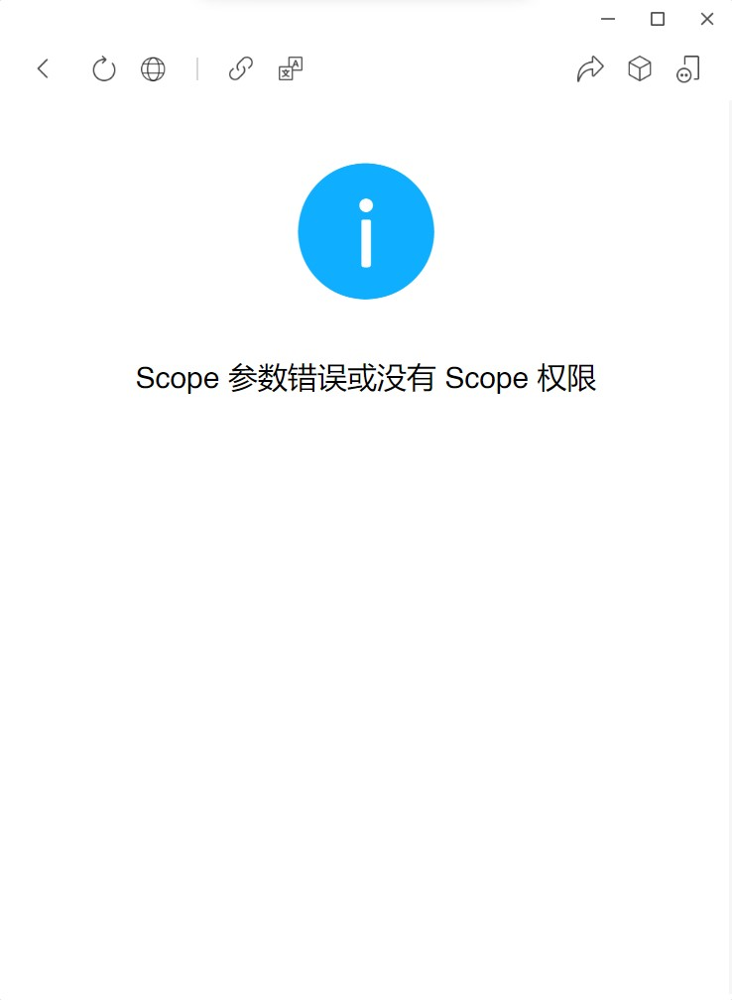
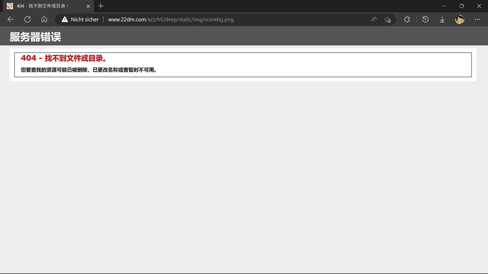
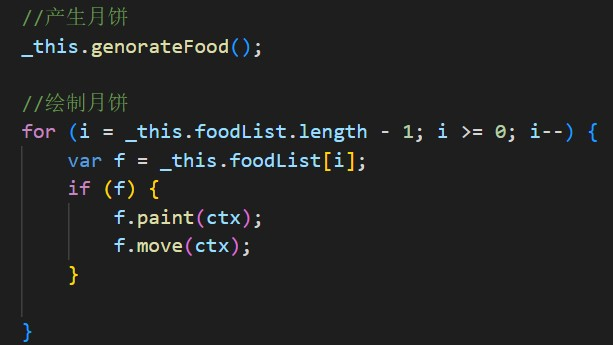
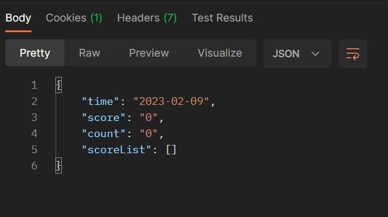
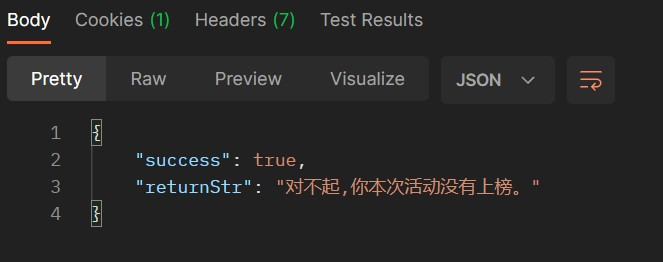
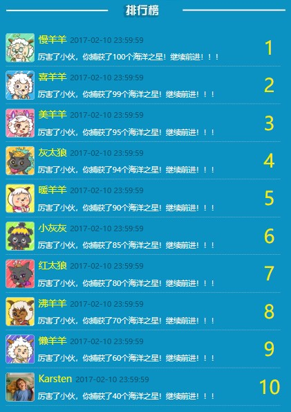

# 冲出海洋
原创动力的小游戏“冲出海洋”的原版拷贝及修改版本。
- 活动ID：15
- 项目名称：`deep`

## 原始版本
文件夹`www.22dm.com`内存储着游戏的原始版本。因为游戏有排行系统，需要直接向微信获取信息，所以必须在微信中打开才行。然后微信会报错`Scope 参数错误或没有 Scope 权限`，所以现在玩不了了。

## 修改版本
文件夹`xyy-huijiwiki.github.io`内存储着游戏的修改版本。修改内容如下：
- 去除了所有微信和百度的内容，确保游戏能够独立运行。
- 现在已经无法获取到实际排行榜了，所以我自己杜撰了一个排行榜。另外，玩家得分情况会且只会上传至服务器，刷新页面（重新向服务器获取排行榜）后才会更新排行榜，而修改版的游戏不与服务器连接（连接了也没有，现在排行榜返回空值），所以自己的分数永远不会出现在排行榜中（况且我也获取不到你的微信昵称和头像）。
- 修复了获奖后提交信息时的一处显示bug，不知道是这六年来浏览器版本更新造成的还是微信内置浏览器的特性。
- 领奖时不会真的向服务器发送消息。
- 制作了三个版本，分别对应**活动时间是否结束**和**是否获奖**。

## 链接
请在手机上游玩，或者按F12在开发者工具中调整为竖屏或模拟手机。按F12切换开发者模式会导致游戏出bug，刷新一次即可。
- [官方游戏链接](http://www.22dm.com/act/h5/deep)
- [修改版游戏链接1](https://xyy-huijiwiki.github.io/22dm-act/xyy-huijiwiki.github.io/act/h5/deep/index.html)（活动未结束）
- [修改版游戏链接2](https://xyy-huijiwiki.github.io/22dm-act/xyy-huijiwiki.github.io/act/h5/deep/index2.html)（活动未结束、未获奖）
- [修改版游戏链接3](https://xyy-huijiwiki.github.io/22dm-act/xyy-huijiwiki.github.io/act/h5/deep/index3.html)（活动已结束、获奖）
- [羊羊百科](https://xyy.huijiwiki.com/wiki/冲出海洋)

## 秘密
我对“冲出海洋”这款小游戏印象很深。那时我重新接触喜羊羊不久，陆续发现了羊羊官网、官微、官博等儿时闻所未闻的渠道，非常开心。而“冲出海洋”正是这不久后原创动力推出的一款微信小游戏，是我接触到的第一款羊羊微信小游戏（实际上，如果不算以**嫁人就嫁灰太狼**为主题的[小透明减压室](https://xyy-huijiwiki.github.io/jyfy)和[性格测试](https://xyy-huijiwiki.github.io/cs)的话，这也是第一款羊羊微信小游戏）。不仅如此，“冲出海洋”上线的首月，排名前十的玩家将可以获得羊羊礼品一份。当时我以为这样的活动由来已久，但实际上这是第一次。彼时我应该已经初三下学期了，但是游戏的乐趣和奖励的诱惑依然让我沉迷其中，最终“杀入”前十夺得奖品。

如今六年已经过去——想想六岁的孩子和婴儿的差距吧——曾经怀念童年的时光，如今竟也变得值得怀念了。记得当时我特别厌烦所谓“老粉”的怀旧情绪，就算不反感新剧，也总是抓着过去不放，仿佛羊羊只有过去的辉煌，缺少未来的道路。现在我也有点像这样的“老粉”了，所以才开始了对“冲出海洋”的修改工作。一方面，我挺想再玩一玩这款让我开心、让我获奖、让我印象深刻的小游戏；另一方面，我也想收集一些游戏里的图片，作为[羊羊百科](https://xyy.huijiwiki.com)的配图。

不过当我再次打开游戏时，得到的只有`Scope 参数错误或没有 Scope 权限`。

后来我发现，比“冲出海洋”更早出现的“小透明减压室”和“性格测试”依然可以正常游玩。也就是说，原创动力可能并没有删除游戏，仅仅是因为后来没有维护，没法正常连接微信获取用户数据了而已（因为排名系统使用的是微信头像和微信昵称）。

于是我从当年的微信游戏链接中找到了游戏的实际链接，获取到了HTML文件和JS文件。此时我既兴奋，又害怕，天知道我这点三脚猫的编程水平能让我走到哪一步，不过最坏的结果也是从中找到图片链接，下载下来给**羊羊百科**做配图。

接下来的步骤竟然比较顺利。首先是HTML文件和JS文件中的代码没有被压缩混淆，注释什么的都还在。换言之，我拿到的代码就是给人看的版本。其次，代码中自带debug模式，开启后即可跳过微信验证步骤，我的修改计划直接成功一半。再者，图片文件下载顺利，官网一张图也没删。

这中间还有一个小插曲，上面截图里请求的图片确确实实下载失败了，当时我心就凉了一大截。一张图片下载失败，就意味着有无数张潜在的图片会下载失败。后来我随便拿了一张图顶着，发现图片应该是游戏右上角得分数字的背景。结果，当我翻开当年官方发的微信文章一看，那个地方明明没有背景图啊！虚晃一枪。应该是原本有背景图的，后来取消了，这部分代码又忘记删了——不影响游戏，但是调试游戏的过程中控制台会报错。

另外，在查看“小透明减压室”的代码时，我就怀疑代码是别处复制过来然后改写的，毕竟图片名称和图片内容完全没关系。但是代码中没有找到其他蛛丝马迹，所以不敢完全确认。而“冲出海洋”我就确认了。通过下面的源代码截图就能一眼看出——只要你认同“冲出海洋”和“月饼”是没有关系。

其实不仅游戏本身没有被原创动力删除，服务器接口也还在，只不过无法获取数据了。下图中`ScoreList`就是前十名的排行榜，可以看到内容是空的。

我还直接调用了一下领奖的api，因为服务器那边已经没有排行榜名单了，所以领奖必然失败。实际上就算有名单也没用，因为身份信息验证用的是微信的openid，以微信的安全技术，不用想啦。

排行榜获取不到了，我就自己杜撰了一份排行榜。因为获取的海洋之星数量在代码中用`score`来表示，而`score`又有`分数`的意思，我第一时间想到了考试分数。所以我按照我对羊狼们的印象编了一份满分100分的“成绩单”。慢羊羊是出题者，所以他满分。最后一个是我自己，用的是我现在的头像和用户名。我给了自己不及格的分数，因为我知道我大学成绩单上的61分都是老师的功劳而不是我的功劳。羊狼们的头像用的是《羊年喜羊羊》官网里的头像，因为六年前我用的就是其中喜羊羊的头像。

我向来讨厌别人说“时间过得真快，一眨眼就……”。时间在宇宙尺度上或许有快有慢，但对于日常生活而言就是没什么区别。但每当自己写点什么东西的时候，又总是忍不住想写这样的句子。可能只是包括我在内许多中国人的写作习惯而已吧。六年前，手机还是清一色的16:9屏幕，如今的长屏手机再玩“冲出海洋”，是会有显示bug的；六年前，我在上初三，仿佛学生生涯永远不会结束，毕竟已经上了十几年的学了，将来还要在学校度过近十年甚至更久；六年前，我身体上刚刚告别童年，心理上无比想与童年建立更长久的关联……

这修改版的“冲出海洋”，献给我怀念童年的青春。